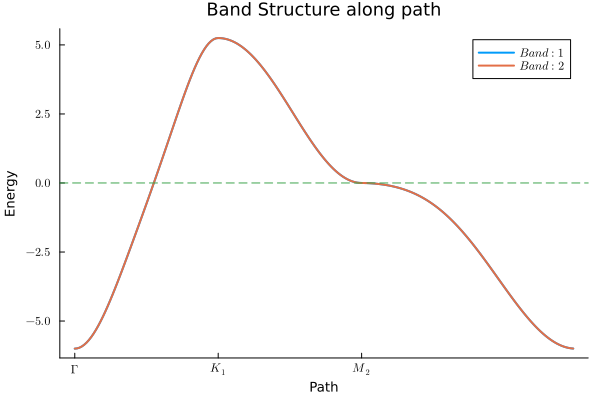

# TightBindingToolkit

[](https://github.com/sreekar-voleti/TightBindingToolkit.jl/actions/workflows/CI.yml?query=branch%3Amain)

TightBindingToolkit.jl is a Julia package meant for constructing, and obtaining useful properties of generic tight-binding models. It supports any lattice structure, with any user-defined bonds on that lattice. It also has support for any spin of the particle hopping on the lattice.

## Install
In the Julia REPL, Push "]" to enter the package mode.
```julia
add TightBindingToolkit
```
Or equivalently
```julia
using Pkg
Pkg.add("TightBindingToolkit")
```

## Features
Currently supported :
* Custom Unit Cell Construction. (v1.3) : now also supports construction in dimensions upto d=3. Can change primitives, or expand unit cell on the go.
    ||
    |:--:| 
    |*Honeycomb Model with 1st, 2nd and 3rd neighbour hoppings.*|
* Corresponding Brillouin Zone Construction. (v1.3) : now also supports construction in dimensions upto d=3.
* Hamiltonian, given a Unit Cell and a Brillouin Zone. (v1.3) : now also support BdG Hamiltonians.
* Diagonalizing the Hamiltonian in momentum space to get band structures and wavefunctions.
    ||
    |:--:| 
    |*Band structure for a triangular lattice with 1st, 2nd and 3rd neighbour hopping.*|
* Density of State 
    ||
    |:--:| 
    |*Density of state of graphene.*|
* Filling the model at given chemical potential, and calculating gaps. (v1.3) : also supported for BdG systems.
    ||
    |:--:| 
    |*Band structure of the Kitaev Chain in 1-d.*|
* Fermi surfaces of systems
    ||
    |:--:| 
    |*Fermi surface for a triangular lattice with 1st, 2nd and 3rd neighbour hopping.*|
* Getting correlation functionsin momentum space and real space. (v1.3) : also supported for BdG systems.
* Getting Berry curvature and Chern numbers. Also workjs for topological superconductors.
    ||
    |:--:| 
    |*Chern numbers in a spin-ful Haldane model as a function of t2.*|
* Getting magnetic susceptibility in any direction, at any momentum, and energy.
    ||
    |:--:| 
    |*imaginary part of zero-energy susceptibility for a triangular lattice with 1st, 2nd and 3rd neighbour hopping.*|
* Real-sapce lattice construction with arbitrary boundary condition. (v2.1)

## Documentation
For more details, please see [Documentation](https://anjishnubose.github.io/TightBindingToolkit.jl/dev/)
